<p align="center">
  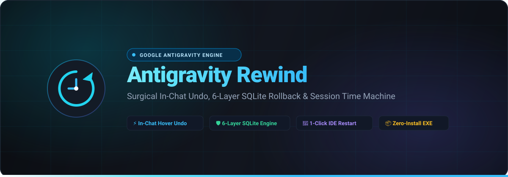
</p>

<p align="center">
  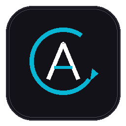
</p>

<h1 align="center">Antigravity Rewind</h1>

<p align="center">
  <strong>The Surgical Time Machine, Undo Engine & Conversation Manager for Google Antigravity</strong>
</p>

<p align="center">
  <em>Effortlessly undo stuck thinking, runaway tool loops, filter blocks ("I cannot assist with that"), and corrupted sessions with 100% byte-for-byte SQLite parity.</em>
</p>

<p align="center">
  <a href="https://github.com/ilyassbourass/antigravity-rewind/releases"></a>
  <a href="https://github.com/ilyassbourass/antigravity-rewind/stargazers"></a>
  
  
  
  <a href="LICENSE"></a>
</p>

<p align="center">
  <a href="#-quick-download"><strong>⚡ Quick Download</strong></a> •
  <a href="#-why-antigravity-rewind"><strong>💡 Why Rewind?</strong></a> •
  <a href="#-visual-tour"><strong>📸 Visual Tour</strong></a> •
  <a href="#-key-features"><strong>✨ Features</strong></a> •
  <a href="#-architecture"><strong>🏛️ Architecture</strong></a> •
  <a href="#-installation"><strong>🚀 Getting Started</strong></a> •
  <a href="#-faq"><strong>❓ FAQ</strong></a>
</p>

---

## ⚡ Quick Download

Download the zero-install, ready-to-run desktop executable:

👉 **[Download AntigravityRewind.exe (Latest Release)](https://github.com/ilyassbourass/antigravity-rewind/releases/latest)**

*No Python, Node.js, or runtime installation required. Simply double-click and launch.*

---

## 💡 Why Antigravity Rewind?

**Google Antigravity** is one of the most powerful agentic AI coding platforms in existence. However, developers working on extensive, multi-hour coding sessions inevitably hit critical stumbling blocks:

### 🛑 1. The Context-Polluting Refusal Block ("I cannot assist with that")
When Gemini or an agentic tool triggers a safety filter or outputs *"I cannot assist with that"*, that turn is permanently committed to your session context. In subsequent prompts, the model repeatedly fixates on the refusal and refuses to proceed.  
**Antigravity Rewind Solution:** Hover over the offending message or tool turn, click **Undo from here**, and surgically purge it from the SQLite database and transcript streams in 1 second. Your conversation is instantly freed.

### 🛑 2. Runaway Thinking & Infinite Tool Loops
Occasionally, the model spends 3+ minutes in a runaway thinking loop or initiates recursive web searches / test executions you didn't ask for.  
**Antigravity Rewind Solution:** Stop the process, open Antigravity Rewind, and rewind to the exact turn before the model went off track.

### 🛑 3. Google Antigravity's Disappearing Conversation Bug
Users frequently report that clicking the native Antigravity "Undo" or "Restore" button causes the entire thread to disappear from the sidebar or triggers accidental file deletion prompts for files modified in later turns.  
**Antigravity Rewind Solution:** Uses a **6-Layer Atomic SQLite Rollback Engine** that prunes logs, updates WAL checkpoints, re-slices 100 KB virtual scroll chunks, and creates non-destructive snapshot backups beforehand. Zero code loss. Zero file risk.

### 🛑 4. Safe Branching & Time Travel
Want to explore an alternative architectural approach without losing your 500-step session? Take an instant milestone snapshot, test your idea, and revert back with 1 click anytime.

---

## 📸 Visual Tour

### 🎯 1. Authentic Antigravity UI with Injected Undo
*Crafted from scratch to look, feel, and behave identically to Google Antigravity.*

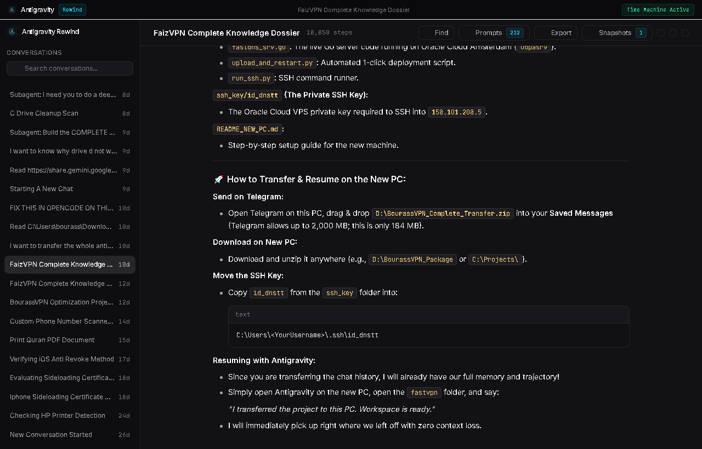

---

### ⚡ 2. Injected In-Chat Hover Undo & Ghost Pruning
*Hover over any user message, thinking block, command group, or assistant response. Ghost pruning dynamically dims future messages in real-time before you confirm.*

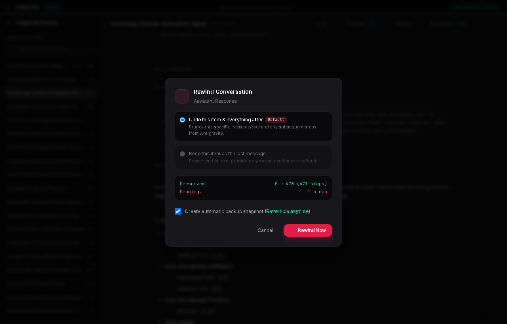

---

### 🛡️ 3. Time Machine Snapshots with Exact Timestamps
*Inspect all snapshots with real timestamps, milestone step numbers, thread titles, and active state indicators.*

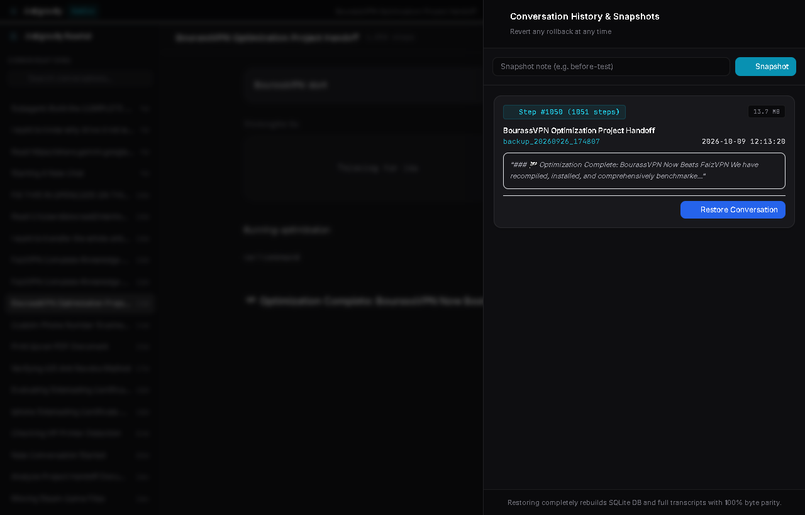

---

### 🔄 4. 1-Click "Restart Antigravity" Prompt
*When you rewind or restore, Antigravity Rewind prompts you to restart Antigravity.exe with a single click, immediately loading your rewound session into your editor.*

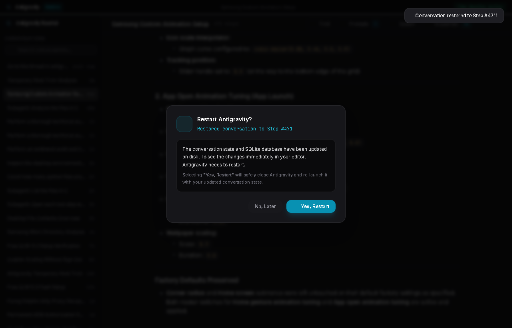

---

### 🌓 5. Dynamic Dark & Light Themes
*Toggle between authentic Antigravity Dark and crisp Paper Light modes with Ctrl+, or the top header icon.*

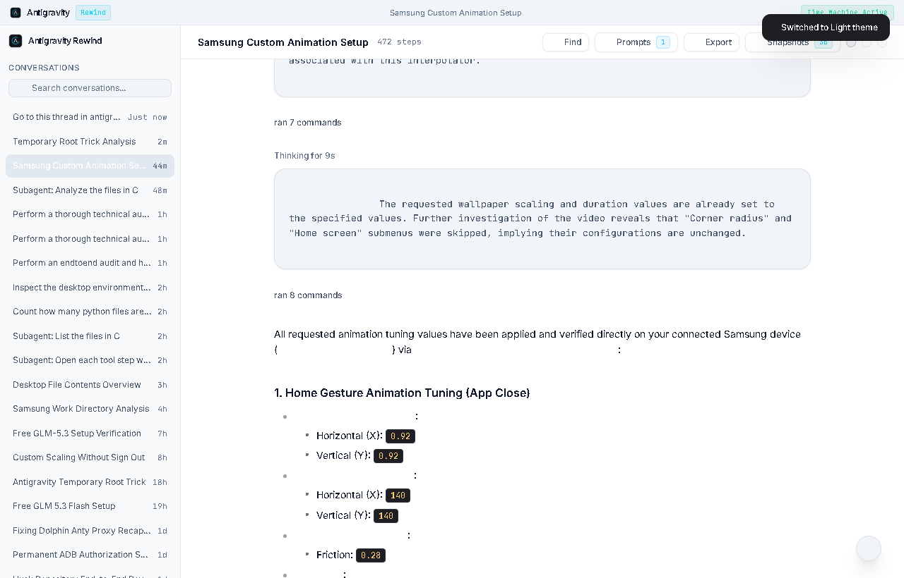

---

### 📜 6. Full-Height User Prompts Drawer & Fast Jump
*Click the **Prompts** header button or press <kbd>Ctrl</kbd> + <kbd>P</kbd> to slide out a full-height drawer displaying every user instruction. Click any prompt card to instantly scroll directly to that exact turn with a glowing amber highlight.*

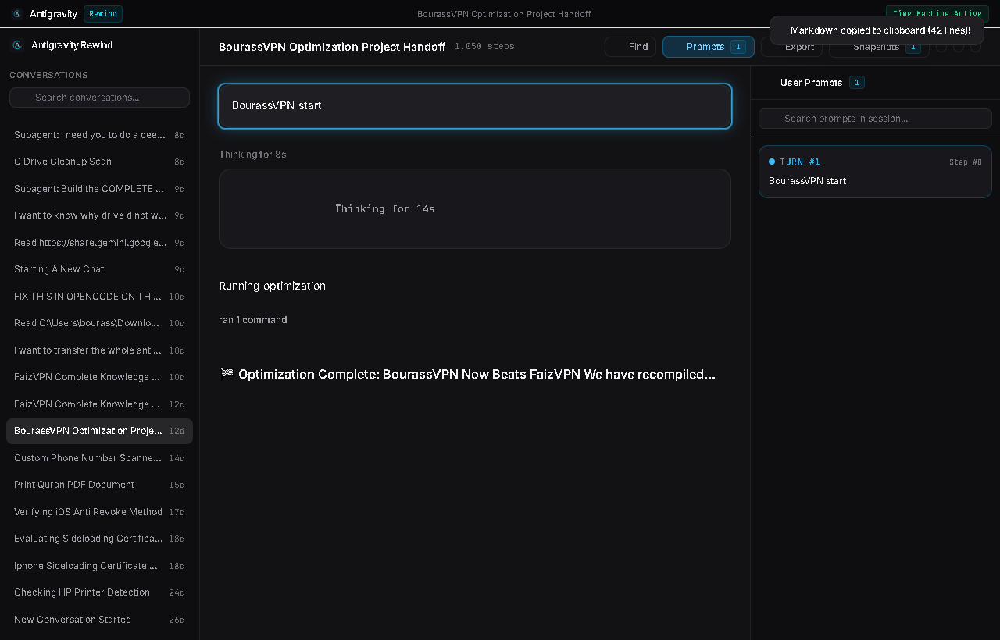

---

### 🔍 7. Accurate In-Session Search
*Press <kbd>Ctrl</kbd> + <kbd>F</kbd> or click **Find** to perform real-time, case-insensitive search across the entire conversation. Instantly highlights matching phrases with hit counter (`1/3`) and next/previous cycling.*

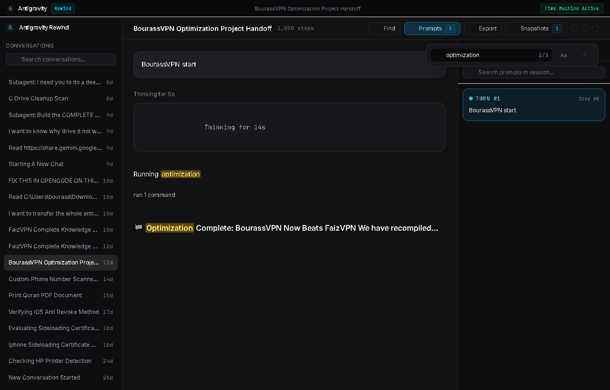

---

### 📥 8. Markdown Session Export with Thinking & Tool Filters
*Click **Export** or press <kbd>Ctrl</kbd> + <kbd>E</kbd> to open the Markdown Export modal. Granularly toggle whether to include internal `<thinking>` blocks and tool execution calls, then copy to clipboard or download as a `.md` file.*

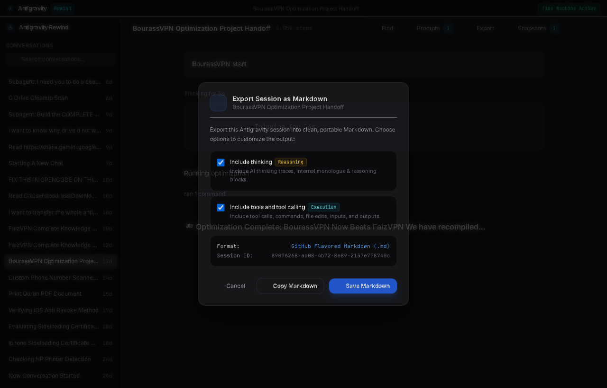

---

### 🏷️ 9. Human-Readable Resolved Conversation Titles
*Never struggle with raw UUIDs again. Antigravity Rewind parses and caches human-readable intent summaries for every conversation automatically.*

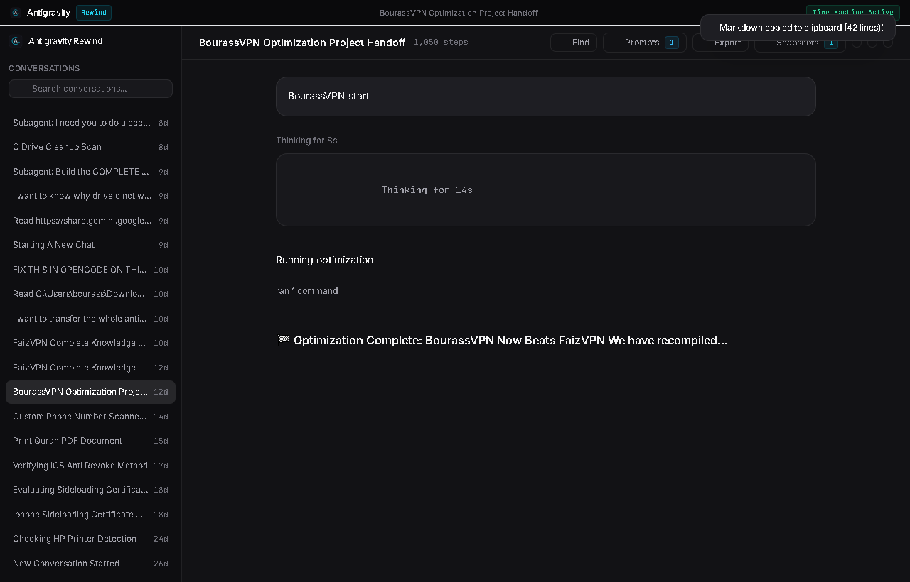

---

## ✨ Key Features

| Feature | Description |
| :--- | :--- |
| **Surgical In-Chat Undo** | Injected controls beside every message, thinking block, file diff, and tool execution group. |
| **Ghost Pruning Diff** | Real-time crimson preview showing exactly which turns will be pruned before you confirm. |
| **Full-Height Prompts Drawer** | Slide-out right panel showing all user prompts in chronological order with instant jump-to-turn navigation. |
| **Accurate In-Session Search** | Live regex/substring search bar (<kbd>Ctrl</kbd>+<kbd>F</kbd>) with match count, previous/next controls, and glowing mark highlights. |
| **Markdown Session Export** | Granular export modal (<kbd>Ctrl</kbd>+<kbd>E</kbd>) with selective checkboxes for internal thinking traces and tool call executions. |
| **Resolved Thread Titles** | Fast initial-turn title resolution that replaces cryptic UUID hashes with human-readable intent. |
| **Restart Antigravity Prompt** | Automated modal that terminates `Antigravity.exe`, releases database locks, and relaunches the editor with 1 click. |
| **Real Timestamp Snapshots** | Clean timestamping (`YYYY-MM-DD HH:MM:SS`) and active milestone badges for effortless session time travel. |
| **Disappearing Thread Fixer** | Directly accesses `.gemini/antigravity` storage, recovering sessions hidden by UI glitches. |
| **Filter Block Remover** | Eliminates safety refusal turns (`I cannot assist with that`) from SQLite context so conversations stay productive. |
| **Tail Deque Streaming** | Tested on **18,790-step** enterprise sessions (FaizVPN) — loads in **0.15 seconds** with zero UI lag. |
| **Instant Bottom Placement** | Immediately jumps to the latest turn upon opening a conversation without sluggish step-by-step scrolling. |
| **Dark & Light Modes** | Authentic Antigravity obsidian theme and high-contrast paper light theme. |
| **Zero External Dependencies** | Core app uses 100% native Python standard library modules (`sqlite3`, `http.server`, `urllib`). |

---

## 🏛️ Architecture: The 6-Layer Atomic Rollback Engine

When Google Antigravity runs, it manages state across multiple synchronized layers. A naive edit to SQLite will corrupt the transcript or crash the virtual scroll buffer. `Antigravity Rewind` coordinates a simultaneous 6-layer atomic rollback:

```
[ Antigravity Rewind Engine ]
           │
           ├── 1. SQLite Database (conversations/<id>.db)
           │      └── Deletes steps > target_step; executes PRAGMA wal_checkpoint(TRUNCATE) & VACUUM
           │
           ├── 2. Compact Transcript (logs/transcript.jsonl)
           │      └── Rewinds JSONL event stream to exact target step index
           │
           ├── 3. Full Payload Transcript (logs/transcript_full.jsonl)
           │      └── Truncates full turn payload data with byte parity
           │
           ├── 4. Virtual Scroll Chunks (chunks/transcript/ & chunks/transcript_full/)
           │      └── Re-slices 100 KB (102,400 bytes) binary chunks to eliminate IDE UI scroll crashes
           │
           ├── 5. Output Artifacts (steps/<step_idx>/)
           │      └── Safely prunes post-cut temporary tool output files
           │
           └── 6. Message Queues & Task Logs (tasks/ & messages/)
                  └── Synchronizes read.json tracking and removes obsolete task outputs
```

---

## 🚀 Getting Started

### Option 1: Standalone Desktop App (Recommended)
1. Download **[`AntigravityRewind.exe`](https://github.com/ilyassbourass/antigravity-rewind/releases/latest)** from the Releases page.
2. Place it anywhere on your computer and double-click to launch.
3. Antigravity Rewind automatically detects your Antigravity installation and lists your conversations!

### Option 2: Run from Source
```bash
# Clone the repository
git clone https://github.com/ilyassbourass/antigravity-rewind.git
cd antigravity-rewind

# Run desktop application (Uses Python standard library)
python app.py
```

### Option 3: Build Standalone Executable
```bash
# Install PyInstaller
pip install pyinstaller

# Run Windows build script
build_exe.bat
```

---

## ⌨️ Keyboard Shortcuts

| Shortcut | Action |
| :--- | :--- |
| <kbd>Ctrl</kbd> + <kbd>P</kbd> | Toggle User Prompts Drawer (Jump-to-turn navigation) |
| <kbd>Ctrl</kbd> + <kbd>F</kbd> | Open In-Session Search Bar (with Next/Prev match cycling) |
| <kbd>Ctrl</kbd> + <kbd>E</kbd> | Open Session Markdown Export Dialog |
| <kbd>Ctrl</kbd> + <kbd>H</kbd> | Toggle History & Snapshots Drawer |
| <kbd>Ctrl</kbd> + <kbd>R</kbd> | Refresh conversations and live feed |
| <kbd>Ctrl</kbd> + <kbd>,</kbd> | Open Settings & Preferences Modal |
| <kbd>Esc</kbd> | Close any open drawer, modal, or prompt |

---

## 🧪 Automated Testing & Verification

Antigravity Rewind is rigorously tested using an end-to-end Playwright test suite that verifies human-like interactions against real Antigravity database trajectories:

```bash
# Install Playwright
pip install playwright
python -m playwright install chromium

# Run End-to-End Test Suite
python verify_playwright_e2e.py
```

**Test Coverage (16 E2E Tests):**
- 100% of dialogs verified (zero native browser alert leaks)
- Rollback execution & SQLite parity
- In-drawer milestone restoration
- "Restart Antigravity" modal triggering & dismissal
- Real-time timestamp rendering
- Instant tail-deque loading on large sessions (18,790+ steps)
- Markdown session export across all 4 permutations (Thinking/Tools toggles)
- Full-height Prompts drawer slide-out and jump-to-prompt card navigation
- Accurate search hit highlighting, match counter, and cycling
- Sidebar conversation title resolution (0 raw UUID leaks)

---

## ❓ Frequently Asked Questions (FAQ)

<details>
<summary><strong>Does Antigravity Rewind delete my actual project source files?</strong></summary>
<p><strong>No.</strong> Antigravity Rewind operates strictly on Antigravity's conversation database (<code>.gemini/antigravity/conversations/</code> and <code>.gemini/antigravity/brain/</code>). It never touches or deletes files in your workspace project directory. Furthermore, an automatic snapshot is saved prior to every rollback.</p>
</details>

<details>
<summary><strong>What happens if Antigravity is open when I perform an Undo?</strong></summary>
<p>When you click "Rewind" or "Restore", Antigravity Rewind prompts you: <em>"Restart Antigravity? [Yes, Restart] [No, Later]"</em>. Clicking <strong>Yes, Restart</strong> terminates <code>Antigravity.exe</code>, waits for SQLite file locks to clear, and relaunches the editor so the rewound state displays instantly.</p>
</details>

<details>
<summary><strong>Can I undo an undo (time-travel back forward)?</strong></summary>
<p><strong>Yes!</strong> Every time you perform an undo or restore, an automatic snapshot is preserved in the Snapshots drawer. You can return to any previous milestone at any time.</p>
</details>

<details>
<summary><strong>How does this fix "I cannot assist with that" filter blocks?</strong></summary>
<p>When Gemini generates a safety refusal, that message turn is written into SQLite. Every prompt after that sends the refusal back to the model as part of the context window. Rewinding to the step right before the refusal turn purges it completely, allowing you to rephrase your instruction and continue your session without interference.</p>
</details>

---

## 🤝 Contributing

Contributions, issues, and feature requests are welcome!  
Feel free to check the [issues page](https://github.com/ilyassbourass/antigravity-rewind/issues).

1. Fork the Project
2. Create your Feature Branch (`git checkout -b feature/AmazingFeature`)
3. Commit your Changes (`git commit -m 'Add some AmazingFeature'`)
4. Push to the Branch (`git push origin feature/AmazingFeature`)
5. Open a Pull Request

---

## 🌟 Show Your Support

If **Antigravity Rewind** saved your conversation, fixed a stuck loop, or made your agentic workflow smoother, please consider giving this repository a **Star ⭐**! It helps more developers discover the tool.

---

## 📄 License

Distributed under the **MIT License**. See [`LICENSE`](LICENSE) for more information.

<p align="center">
  <sub>Built with ❤️ for the Google Antigravity & Agentic AI developer community.</sub>
</p>
